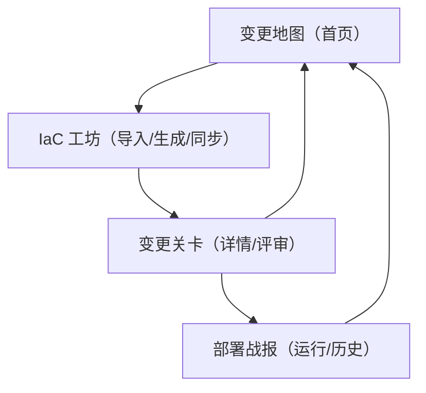

## 1. Product Overview
面向 IaC（Terraform/CloudFormation 等）的“像素游戏化”变更交付套件：把从“现网资源 → IaC 代码 → 校验/计划 → 测试部署 → 生产试运行 → 复盘”做成可探索的关卡流程。
主要用户是开发、运维/DevOps、SRE；目标是把复杂且高风险的 IaC 生命周期拆成可回放、可度量、可控闸门的任务链路。

## 2. Core Features

### 2.0 Real-world Scenarios（本轮对齐的真实场景）
| 场景 | 输入 | 目标输出 | 核心难点 |
|------|------|----------|----------|
| 场景 1：现网有资源 → 生成 IaC | 云账号/集群/资源范围 | 可落库的 IaC 工程（模块化/变量化）+ 资源清单 | 资源归属与权限、不可表达字段、资源命名与依赖图 |
| 场景 2：现网有资源 + 已有 IaC → 同步/更新 IaC | 现网资源 + IaC repo | Drift 报告 + 可合并的 IaC Patch（PR/commit） | Drift 分类（期望漂移 vs 非法漂移）、最小变更、避免破坏性操作 |
| 场景 3：从 0 创建资源 → 生成 IaC | 需求/模板/参数 | IaC 初始化工程 + 计划与发布流水 | 模板选择、策略约束、成本预估、环境推广 |

### 2.1 User Roles
| 角色 | 注册方式 | 核心权限 |
|------|----------|----------|
| 提交者（Dev/DevOps） | 邮箱注册/登录 | 创建变更、上传/录入 plan、发起执行、查看战报 |
| 审核者（Reviewer） | 邮箱注册/登录 | 评审 diff、提出问题、通过/拒绝、触发或阻止执行 |
| 管理员（Admin） | 由系统指定 | 配置环境与策略、管理成员、查看全量审计 |

### 2.2 Feature Module
本产品最小可用版本包含以下页面：
1. **变更地图（首页）**：像素世界总览、变更任务列表、创建/导入变更入口。
2. **IaC 工坊（导入/生成/同步）**：从现网扫描生成 IaC、或基于现网对现有 IaC 做同步更新（drift → patch）。
3. **变更关卡（详情/评审）**：变更摘要、差异（diff/patch）、风险提示、评审与闸门。
4. **部署战报（运行/历史）**：语法校验、计划生成、测试部署、生产试运行的时间轴与日志，含回滚与复盘。

### 2.3 Page Details
| Page Name | Module Name | Feature description |
|-----------|-------------|---------------------|
| 变更地图（首页） | 像素世界总览 | 用“地图/关卡节点”展示环境（dev/stage/prod）与当前变更所在关卡；点击节点进入对应变更详情。 |
| 变更地图（首页） | 变更任务列表 | 展示最近变更（状态：草稿/待审/已批/执行中/成功/失败）；支持按环境与状态筛选。 |
| 变更地图（首页） | 创建任务 | 选择任务类型：①现网→生成 IaC；②现网+IaC→同步 IaC；③从 0→生成 IaC；生成“任务卡”。 |
| IaC 工坊 | 现网扫描与清单 | 选择账号/范围 → 扫描 → 生成资源清单（Inventory）与依赖图；可标记“托管/忽略/只读”。 |
| IaC 工坊 | 生成/同步 IaC | 输出 IaC 工程或 Patch（diff）；提供策略/风险/成本提示；可导出到 repo 或下载。 |
| 变更关卡（详情/评审） | 变更摘要卡 | 展示提交人、目标环境、影响资源数、预计耗时、当前关卡进度（像素进度条）。 |
| 变更关卡（详情/评审） | 差异视图（Diff/Patch） | 既支持 plan diff，也支持 IaC patch（文件 diff）；高风险标记（删除、权限扩大）默认置顶。 |
| 变更关卡（详情/评审） | 评审与审批 | 审核者发表评论/提问；提交者回复；审核者通过/拒绝；通过后解锁“执行按钮”。 |
| 变更关卡（详情/评审） | 执行前检查（轻量） | 执行前展示检查清单（变量/版本/锁）；原型阶段为可勾选的确认项与提示。 |
| 部署战报（运行/历史） | 运行时间轴 | 展示步骤（语法校验→计划生成→测试部署→生产试运行→验证→完成/回滚）与状态。 |
| 部署战报（运行/历史） | 关键日志与错误定位 | 以“战斗记录”形式展示关键日志片段；失败时高亮错误并给出下一步建议（固定文案）。 |
| 部署战报（运行/历史） | 回滚与复盘 | 提供“回滚按钮”（原型为二次确认+模拟结果）；记录复盘要点与结论标签。 |

## 3. Core Process
**提交者流程（统一框架）**：在变更地图创建任务卡（选择场景）→ 进入 IaC 工坊完成“扫描/生成/同步”→ 进入变更关卡确认 diff/patch 与风险提示 → 提交评审 → 闸门通过后进入部署战报（校验/计划/测试/试运行）→ 失败回滚并复盘。

**审核者流程**：在变更地图筛选“待审” → 进入变更关卡优先查看高风险项（删除/权限扩大/drift 类别）→ 评论/要求补充 → 通过或拒绝 → 跟踪战报。

**页面导航（Mermaid）**

---
### 可交互原型范围说明（MVP Prototype Scope）
- 覆盖 3 条可点击主链路：创建变更 → 评审通过 → 查看战报（成功/失败两种分支）。
- 使用模拟数据（不真实解析/执行 IaC），但交互状态完整：关卡解锁、按钮禁用/启用、状态流转、时间轴推进。
- 不包含：真实 Terraform 执行、权限与策略引擎、与代码仓库/CI 的真实集成、多租户计费。 

### 用户故事（User Stories）
1. 作为提交者，我想从现网资源一键生成可用的 IaC 工程，这样我能把“现网”变成“可版本化”。
2. 作为提交者，我想让系统识别现网与 IaC 的 drift，并输出可合并的 IaC patch，这样我能安全地对齐代码与现网。
3. 作为提交者，我想从 0 初始化一套 IaC 模板并带策略与成本提示，这样我能更快开始且不踩坑。
4. 作为审核者，我想优先看到高风险项与 drift 分类（期望漂移/非法漂移），这样我能更快做出审核决策。
5. 作为团队成员，我想在战报时间轴回看“校验→计划→测试→试运行→验证”的全过程，这样便于复盘与知识沉淀。
