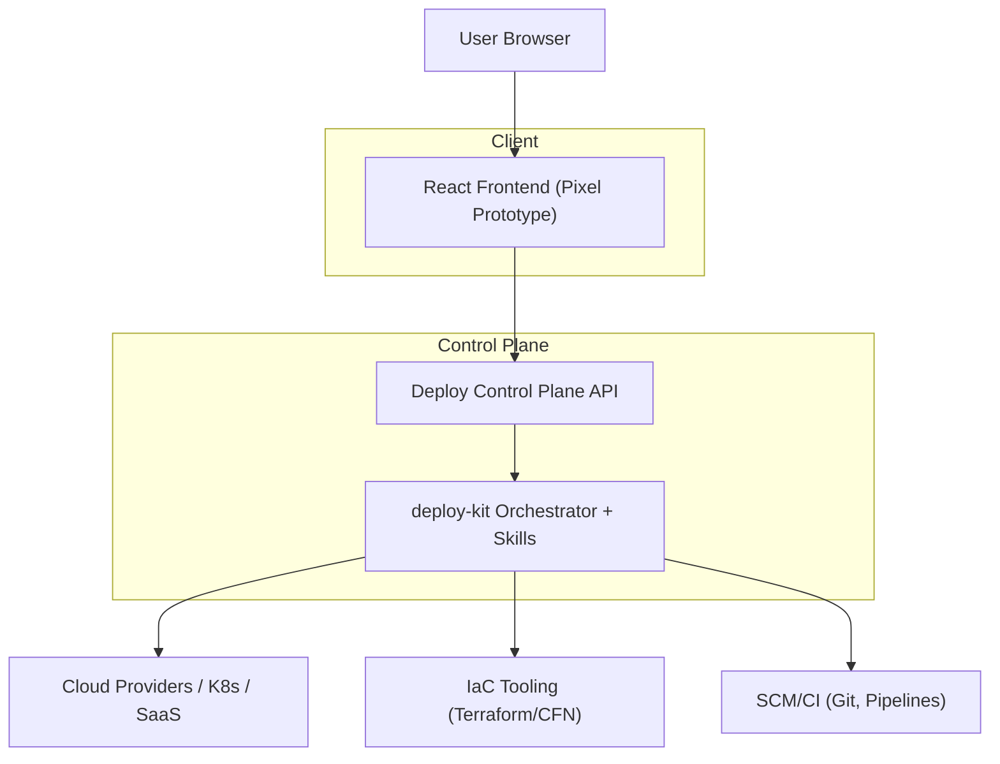
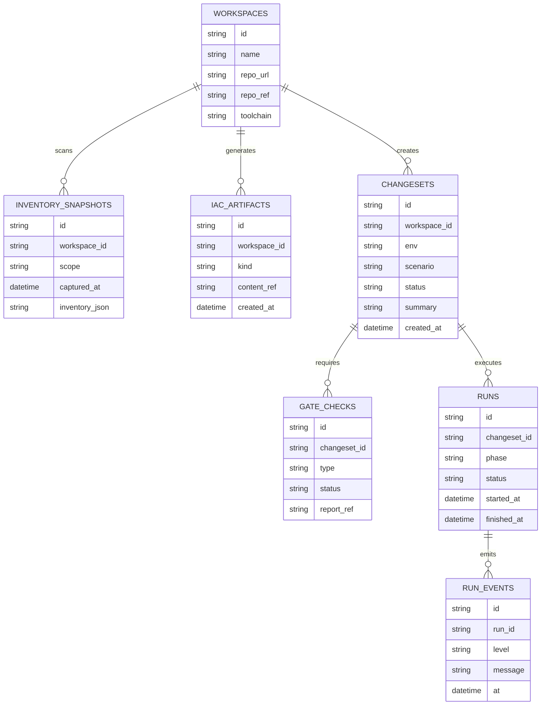

## 1.Architecture design

## 2.Technology Description
- Frontend: React@18 + Vite + TailwindCSS
- Backend: Python（deploy-kit：Orchestrator/StateManager/CacheManager/SkillLoader/MCPCaller）
- API Layer: 可选（将 deploy-kit 封装为 HTTP API，支持 run/stream logs/resume）；原型阶段可先本地模拟

## 3.Route definitions
| Route | Purpose |
|-------|---------|
| /map | 变更地图（首页）：关卡总览与任务列表 |
| /workshop/:id | IaC 工坊：现网扫描、生成/同步 IaC、输出 patch/工程 |
| /changes/:id | 变更关卡：diff、风险提示、评审与审批 |
| /runs/:id | 部署战报：时间轴、日志、复盘与回滚（原型为模拟） |

## 6.Data model(if applicable)

### 6.1 Data model definition

### 6.2 Data Definition Language
本仓库当前实现以本地落盘为主（`StateManager`/`CacheManager`），因此 DDL 仅在未来需要多租户/协作时引入。
