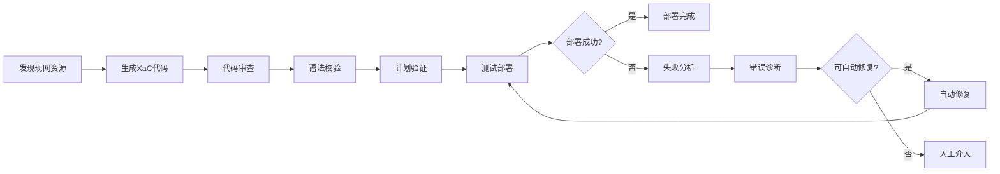
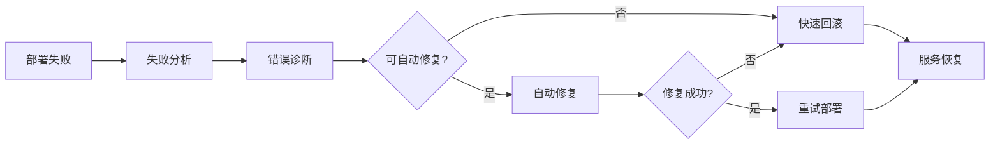

# Deployment Kit 架构设计图

## 📊 整体架构概览

```
┌─────────────────────────────────────────────────────────────────┐
│                    Deployment Kit 整体架构                       │
│                    HIS 代码化部署套件                            │
└─────────────────────────────────────────────────────────────────┘

┌─────────────────────────────────────────────────────────────────┐
│                        用户交互层                                │
│  ┌──────────────────────────┐  ┌──────────────────────────┐    │
│  │       CLI 工具           │  │       Web UI             │    │
│  │  • 命令行交互            │  │  • 可视化界面            │    │
│  │  • 脚本自动化            │  │  • 流程可视化            │    │
│  │  • 批量操作              │  │  • 实时监控面板          │    │
│  └──────────────────────────┘  └──────────────────────────┘    │
└─────────────────────────────────────────────────────────────────┘
                              │
                              ▼
┌─────────────────────────────────────────────────────────────────┐
│                      编排器 (Orchestrator)                       │
│  ┌────────────────────────────────────────────────────────┐    │
│  │  • 工作流调度  • 技能编排  • 上下文管理  • 错误处理    │    │
│  └────────────────────────────────────────────────────────┘    │
└─────────────────────────────────────────────────────────────────┘
                              │
                              ▼
┌─────────────────────────────────────────────────────────────────┐
│                      技能层 (Skills)                             │
│  ┌────────────────────────────────────────────────────────┐    │
│  │  20 个技能                                             │    │
│  │  • 核心技能 9 个：XaC生成/更新、验证、部署、分析        │    │
│  │  • 质量技能 4 个：代码审查、合规检查、监控(规划中)     │    │
│  │  • 管理技能 2 个：配置管理、版本管理                    │    │
│  │  • 应急技能 5 个：诊断、修复、回滚、演练、灰度          │    │
│  │                                                        │    │
│  │  工作流库 (Workflows)                                  │    │
│  │  • 预定义工作流  • 自定义工作流  • 流程模板           │    │
│  │                                                        │    │
│  │  质量保证体系                                          │    │
│  │  • 验证器  • 门控机制  • 合规检查                      │    │
│  └────────────────────────────────────────────────────────┘    │
└─────────────────────────────────────────────────────────────────┘
                              │
                              │ MCP 调用
                              ▼
┌─────────────────────────────────────────────────────────────────┐
│                   MCP 服务层 (Service Layer)                     │
│  ┌───────────────────────────────────────────────────────────┐  │
│  │  CF 平台 - XaC 编排服务                                   │  │
│  │  • 计划验证 (validate-plan)                              │  │
│  │  • 部署执行 (deploy-production / test-deploy)            │  │
│  └───────────────────────────────────────────────────────────┘  │
│                                                                  │
│  📝 其他 MCP 服务（规划中）                                      │
│  • 监控服务                                                     │
│  • 日志分析服务                                                 │
│  • 安全检查服务                                                 │
└─────────────────────────────────────────────────────────────────┘
```

---

## 🎯 技能分类总览

### 📦 技能数量统计

```
总技能数：20个
├── 核心技能 (Core)      ：9个  ━━━━━━━━━━━━ 45%
├── 质量技能 (Quality)   ：4个  ━━━━━ 20%
├── 管理技能 (Management)：2个  ━━ 10%
└── 应急技能 (Emergency) ：5个  ━━━━━━ 25%
```

---

## 🔧 核心技能 (9个) - 主工作流程

```
┌─────────────────────────────────────────────────────────────┐
│                      开发阶段                                 │
├─────────────────────────────────────────────────────────────┤
│                                                              │
│  ① discover-resources                                       │
│  ┌────────────────────────────────────────┐                │
│  │ 资源发现 │ 从现网扫描并分析资源        │                │
│  │           • 扫描华为HIS资源             │                │
│  │           • 分析依赖关系                │                │
│  │           • 生成资源清单                │                │
│  └────────────────────────────────────────┘                │
│                           │                                  │
│                           ▼                                  │
│  ② generate-xac / update-xac                               │
│  ┌────────────────────────────────────────┐                │
│  │ XaC代码生成/更新                        │                │
│  │           • 生成YAML配置                │                │
│  │           • 生成Terraform HCL           │                │
│  │           • 保留用户自定义内容          │                │
│  └────────────────────────────────────────┘                │
│                                                              │
└─────────────────────────────────────────────────────────────┘
                           │
                           ▼
┌─────────────────────────────────────────────────────────────┐
│                      验证阶段                                 │
├─────────────────────────────────────────────────────────────┤
│                                                              │
│  ③ validate-syntax                                          │
│  ┌────────────────────────────────────────┐                │
│  │ 语法校验 │ 验证XaC代码语法             │                │
│  │           • YAML格式检查               │                │
│  │           • Terraform语法验证          │                │
│  │           • 命名规范检查               │                │
│  └────────────────────────────────────────┘                │
│                           │                                  │
│                           ▼                                  │
│  ④ validate-plan                                            │
│  ┌────────────────────────────────────────┐                │
│  │ 计划验证 │ 评估执行计划和风险          │                │
│  │           • 生成执行计划                │                │
│  │           • 风险评估                    │                │
│  │           • 变更影响分析                │                │
│  └────────────────────────────────────────┘                │
│                                                              │
└─────────────────────────────────────────────────────────────┘
                           │
                           ▼
┌─────────────────────────────────────────────────────────────┐
│                      部署阶段                                 │
├─────────────────────────────────────────────────────────────┤
│                                                              │
│  ⑤ test-deploy                                              │
│  ┌────────────────────────────────────────┐                │
│  │ 测试部署 │ 部署到测试环境              │                │
│  │           • 执行terraform apply         │                │
│  │           • 验证资源创建                │                │
│  │           • 健康检查                    │                │
│  └────────────────────────────────────────┘                │
│                           │                                  │
│                           ▼                                  │
│  ⑥ deploy-production                                         │
│  ┌────────────────────────────────────────┐                │
│  │ 生产部署 │ 部署到生产环境              │                │
│  │           • 创建部署检查点              │                │
│  │           • 执行生产部署                │                │
│  │           • 配置监控                    │                │
│  └────────────────────────────────────────┘                │
│                                                              │
└─────────────────────────────────────────────────────────────┘
                           │
                           ▼
┌─────────────────────────────────────────────────────────────┐
│                      分析阶段                                 │
├─────────────────────────────────────────────────────────────┤
│                                                              │
│  ⑦ analyze-failure                                          │
│  ┌────────────────────────────────────────┐                │
│  │ 失败分析 │ 分析部署失败原因            │                │
│  │           • 收集失败信息                │                │
│  │           • 追溯根本原因                │                │
│  │           • 评估影响范围                │                │
│  └────────────────────────────────────────┘                │
│                           │                                  │
│                           ▼                                  │
│  ⑧ evaluate-canary                                          │
│  ┌────────────────────────────────────────┐                │
│  │ 灰度评估 │ 评估灰度发布效果            │                │
│  │           • 对比关键指标                │                │
│  │           • 评估灰度效果                │                │
│  │           • 决策建议                    │                │
│  └────────────────────────────────────────┘                │
│                                                              │
└─────────────────────────────────────────────────────────────┘
```

---

## ✅ 质量技能 (4个) - 质量保证体系

```
┌─────────────────────────────────────────────────────────────┐
│                    质量保证体系                               │
├─────────────────────────────────────────────────────────────┤
│                                                              │
│  ⑨ review-code                                              │
│  ┌────────────────────────────────────────┐                │
│  │ XaC代码审查 │ 静态分析和质量检查      │                │
│  │           • 安全风险检查                │                │
│  │           • 配置质量检查                │                │
│  │           • 最佳实践验证                │                │
│  └────────────────────────────────────────┘                │
│                                                              │
│  ⑩ check-compliance                                         │
│  ┌────────────────────────────────────────┐                │
│  │ 合规检查 │ 安全和合规验证              │                │
│  │           • CIS基准检查                 │                │
│  │           • 安全策略验证                │                │
│  │           • 标签规范检查                │                │
│  └────────────────────────────────────────┘                │
│                                                              │
│  ⑪ monitor-deployment (规划中)                              │
│  ┌────────────────────────────────────────┐                │
│  │ 部署监控 │ 实时监控部署进度            │                │
│  │           • 进度监控                    │                │
│  │           • 日志收集                    │                │
│  │           • 告警通知                    │                │
│  └────────────────────────────────────────┘                │
│                                                              │
│  ⑫ monitor-resources (规划中)                               │
│  ┌────────────────────────────────────────┐                │
│  │ 资源监控 │ 持续监控资源状态            │                │
│  │           • 资源健康检查                │                │
│  │           • 性能指标采集                │                │
│  │           • 容量预测                    │                │
│  └────────────────────────────────────────┘                │
│                                                              │
└─────────────────────────────────────────────────────────────┘
```

---

## 📋 管理技能 (2个) - 跨阶段管理

```
┌─────────────────────────────────────────────────────────────┐
│                    管理技能                                   │
├─────────────────────────────────────────────────────────────┤
│                                                              │
│  ⑬ manage-config                                            │
│  ┌────────────────────────────────────────┐                │
│  │ 配置管理 │ 管理多环境配置              │                │
│  │           • 环境配置隔离                │                │
│  │           • 配置版本管理                │                │
│  │           • 配置差异对比                │                │
│  └────────────────────────────────────────┘                │
│                                                              │
│  ⑭ manage-version                                           │
│  ┌────────────────────────────────────────┐                │
│  │ 版本管理 │ 管理XaC代码版本             │                │
│  │           • 创建版本标签                │                │
│  │           • 版本历史管理                │                │
│  │           • 版本回退                    │                │
│  └────────────────────────────────────────┘                │
│                                                              │
└─────────────────────────────────────────────────────────────┘
```

---

## 🚨 应急技能 (5个) - 异常处理

```
┌─────────────────────────────────────────────────────────────┐
│                    应急处理体系                               │
├─────────────────────────────────────────────────────────────┤
│                                                              │
│  ⑮ diagnose-error                                           │
│  ┌────────────────────────────────────────┐                │
│  │ 错误诊断 │ 深入诊断错误原因            │                │
│  │           • 分析错误日志                │                │
│  │           • 追踪错误来源                │                │
│  │           • 识别配置问题                │                │
│  └────────────────────────────────────────┘                │
│                           │                                  │
│                           ▼                                  │
│  ⑯ auto-fix                                                 │
│  ┌────────────────────────────────────────┐                │
│  │ 自动修复 │ 自动修复常见问题            │                │
│  │           • 应用修复规则                │                │
│  │           • 验证修复结果                │                │
│  │           • 重试部署                    │                │
│  └────────────────────────────────────────┘                │
│                           │                                  │
│                           ▼                                  │
│  ⑰ rollback-deployment                                       │
│  ┌────────────────────────────────────────┐                │
│  │ 快速回滚 │ 回滚到之前稳定版本          │                │
│  │           • 恢复备份状态                │                │
│  │           • 验证服务可用                │                │
│  │           • 生成回滚报告                │                │
│  └────────────────────────────────────────┘                │
│                                                              │
│  ⑱ dry-run-rehearsal                                        │
│  ┌────────────────────────────────────────┐                │
│  │ 生产演练 │ 预演生产部署流程            │                │
│  │           • 模拟生产部署                │                │
│  │           • 测试回滚流程                │                │
│  │           • 评估性能影响                │                │
│  └────────────────────────────────────────┘                │
│                                                              │
│  ⑲ deploy-canary                                            │
│  ┌────────────────────────────────────────┐                │
│  │ 灰度部署 │ 小范围验证后发布            │                │
│  │           • 部署灰度版本                │                │
│  │           • 管理流量切换                │                │
│  │           • 实时监控效果                │                │
│  └────────────────────────────────────────┘                │
│                                                              │
└─────────────────────────────────────────────────────────────┘
```

---

## 🎬 典型应用场景

### 场景 1️⃣：新用户首次部署



**使用技能：**
- discover-resources → generate-xac → review-code → validate-syntax → validate-plan → test-deploy
- 异常处理：analyze-failure → diagnose-error → auto-fix

**特点：** 完整流程，从零开始，适合初次使用

---

### 场景 2️⃣：老用户更新部署


**使用技能：**
- discover-resources → update-xac → review-code → validate-syntax → validate-plan → test-deploy → manage-version

**特点：** 增量更新，保持连续性，版本化管理

---

### 场景 3️⃣：自动触发部署 (CI/CD)


**使用技能：**
- validate-syntax → validate-plan → test-deploy → monitor-deployment(规划中)

**特点：** 自动化，CI/CD集成，快速反馈

---

### 场景 4️⃣：生产部署


**使用技能：**
- review-code → check-compliance → validate-plan → dry-run-rehearsal → evaluate-canary → deploy-production → monitor-deployment(规划中) → monitor-resources(规划中)

**特点：** 多环节验证，风险控制，生产就绪

---

### 场景 5️⃣：部署失败处理



**使用技能：**
- analyze-failure → diagnose-error → auto-fix / rollback-deployment

**特点：** 快速诊断和恢复，最小化故障影响

---

## 🔗 技能关系图

```
                    ┌─────────────────┐
                    │ discover-resources│
                    └────────┬─────────┘
                             │
              ┌──────────────┴──────────────┐
              ▼                             ▼
     ┌─────────────┐              ┌─────────────┐
     │generate-xac │              │ update-xac   │
     └──────┬──────┘              └──────┬──────┘
            │                            │
            └──────────┬─────────────────┘
                       │
                       ▼
              ┌─────────────────┐
              │ review-code     │◄───────┐
              └────────┬─────────┘        │
                       │                  │
                       ▼                  │
              ┌─────────────────┐        │
              │validate-syntax  │        │
              └────────┬─────────┘        │
                       │                  │
                       ▼                  │
              ┌─────────────────┐        │
              │validate-plan    │        │
              └────────┬─────────┘        │
                       │                  │
                       ▼                  │
              ┌─────────────────┐        │
              │ test-deploy     │        │
              └────────┬─────────┘        │
                       │                  │
        ┌──────────────┴───────────┐     │
        ▼                          ▼     │
  ┌──────────┐            ┌──────────┐   │
  │deploy-   │            │analyze-  │   │
  │production│            │failure   │───┘
  └────┬─────┘            └────┬─────┘
       │                       │
       ▼                       ▼
  ┌─────────┐          ┌──────────────┐
  │evaluate │          │diagnose-error│
  │-canary  │          └──────┬───────┘
  └─────────┘                   │
                         ┌──────┴───────┐
                         ▼              ▼
                   ┌──────────┐  ┌──────────┐
                   │auto-fix  │  │rollback- │
                   └──────────┘  │deployment│
                                 └──────────┘

    ┌─────────────────────────────────────┐
    │     质量技能 (贯穿全流程)            │
    │  review-code / check-compliance      │
    │  monitor-deployment / monitor-res.   │
    └─────────────────────────────────────┘

    ┌─────────────────────────────────────┐
    │     管理技能 (跨流程)                │
    │  manage-config / manage-version      │
    └─────────────────────────────────────┘

    ┌─────────────────────────────────────┐
    │     预防技能 (风险控制)              │
    │  dry-run-rehearsal / deploy-canary  │
    └─────────────────────────────────────┘
```

---

## 📈 技能成熟度

```
技能成熟度概览：

核心技能 (9个)
  □□□□□ discover-resources        规划中
  ██████ generate-xac             ✅ 已完成
  □□□□□ update-xac               规划中
  □□□□□ validate-syntax          规划中
  □□□□□ validate-plan            规划中 (CF平台提供)
  □□□□□ test-deploy              规划中 (CF平台提供)
  □□□□□ deploy-production        规划中 (CF平台提供)
  □□□□□ analyze-failure          规划中
  □□□□□ evaluate-canary          规划中

质量技能 (4个)
  □□□□□ review-code              规划中
  □□□□□ check-compliance         规划中
  □□□□□ monitor-deployment       规划中
  □□□□□ monitor-resources        规划中

管理技能 (2个)
  □□□□□ manage-config            规划中
  □□□□□ manage-version           规划中

应急技能 (5个)
  □□□□□ diagnose-error           规划中
  □□□□□ auto-fix                 规划中
  □□□□□ rollback-deployment      规划中
  □□□□□ dry-run-rehearsal        规划中
  □□□□□ deploy-canary            规划中

图例：□ 未开始  ░ 开发中  ▓ 测试中  █ 已完成
```

---

## 🎯 快速导航

| 我想了解 | 文档位置 |
|---------|---------|
| 整体概述 | [01-overview.md](./01-overview.md) |
| 详细技能定义 | [02-skills-definition.md](./02-skills-definition.md) |
| 技能关系 | [03-skill-relationships.md](./03-skill-relationships.md) |
| 预定义工作流 | [04-workflows.md](./04-workflows.md) |
| 编排器设计 | [05-orchestrator-design.md](./05-orchestrator-design.md) |
| 演进机制 | [06-evolution-mechanism.md](./06-evolution-mechanism.md) |

---

## 📝 版本信息

- **架构图版本**：1.0.0
- **创建日期**：2026-03-26
- **技能总数**：20个
- **适用平台**：HIS
- **文档状态**：稳定版

---

**设计理念：**
- 🎯 **技能化**：将复杂流程分解为独立技能单元
- 🔧 **可编排**：灵活组合技能适应不同场景
- ✅ **质量保证**：多层验证确保部署质量
- 🚀 **持续演进**：支持技能持续优化和迭代

---

## 🏗️ 系统架构说明

### 层级关系

```
┌─────────────────────────────────────────────────────────────┐
│  用户交互层 (CLI / Web UI)                                   │
└─────────────────────────────────────────────────────────────┘
                            │
                            ▼
┌─────────────────────────────────────────────────────────────┐
│  编排器 (Orchestrator)                                       │
└─────────────────────────────────────────────────────────────┘
                            │
                            ▼
┌─────────────────────────────────────────────────────────────┐
│  技能层 (Skills)                                             │
│  • 20 个技能的执行和管理                                     │
│  • 工作流编排和调度                                          │
└─────────────────────────────────────────────────────────────┘
                            │
                            │ 通过 MCP 调用
                            ▼
┌─────────────────────────────────────────────────────────────┐
│  MCP 服务层 (Service Layer)                                 │
│  • CF 平台：XaC 编排服务                                     │
│  • 其他 MCP 服务（规划中）                                   │
└─────────────────────────────────────────────────────────────┘
```

### 技能层 (上层)

技能层包含 20 个技能，是部署流程的核心执行层：

**已实现功能：**
- ✅ **XaC 代码生成** (generate-xac / update-xac)
  - 从资源清单生成 XaC 代码
  - 更新已有 XaC 代码
  - 代码格式转换、模板管理

- ✅ **资源管理** (discover-resources)
  - 扫描现网 HIS 资源
  - 资源状态查询、依赖关系分析
  - 资源清单生成与管理

- ✅ **配置管理** (manage-config / manage-version)
  - 多环境配置管理
  - 配置版本控制、环境隔离
  - 配置差异对比、变更追踪

- ✅ **质量保证技能**
  - 代码审查 (review-code)
  - 合规检查 (check-compliance)
  - 语法校验 (validate-syntax)
  - 失败分析 (analyze-failure)
  - 错误诊断 (diagnose-error)
  - 自动修复 (auto-fix)
  - 快速回滚 (rollback-deployment)
  - 生产演练 (dry-run-rehearsal)
  - 灰度部署 (deploy-canary)
  - 灰度评估 (evaluate-canary)

### MCP 服务层 (下层)

通过 MCP 协议提供各种专业服务：

**CF 平台 - XaC 编排服务**
- ✅ **计划验证** (validate-plan)
  - 调用 HIS 资源编排服务
  - 生成执行计划
  - 风险评估与变更分析

- ✅ **部署执行** (deploy-production / test-deploy)
  - 测试环境部署
  - 生产环境部署
  - 部署状态管理

**其他 MCP 服务（规划中）**
- 📝 监控服务（部署监控、资源监控）
- 📝 日志分析服务
- 📝 安全检查服务

### 职责分工

```
┌─────────────────────────────────────────────────────────────┐
│                     部署流程分工                             │
├─────────────────────────────────────────────────────────────┤
│                                                              │
│  技能层 (上层)：                                              │
│  • XaC 代码生成和管理        ← generate-xac / update-xac    │
│  • 资源发现和分析            ← discover-resources           │
│  • 配置管理和版本控制        ← manage-config / version      │
│  • 代码审查、合规检查        ← review-code / compliance      │
│  • 失败诊断和修复            ← analyze / diagnose / fix     │
│  • 流程编排和用户交互                                        │
│                                                              │
│  MCP 服务层 (下层)：                                          │
│  • CF 平台：XaC 计划验证    ← validate-plan                │
│  • CF 平台：XaC 部署执行    ← deploy-production            │
│  • 其他 MCP 服务提供专业能力                                 │
│  • 通过标准 MCP 协议与技能层交互                             │
│                                                              │
└─────────────────────────────────────────────────────────────┘
```

### 典型工作流程

```
用户请求
    │
    ▼
┌───────────────────────────────┐
│  技能层                       │
│  • 资源发现 (discover)        │
│  • 生成 XaC (generate-xac)    │ ← 技能层执行
│  • 代码审查 (review-code)     │
│  • 合规检查 (compliance)      │
└───────────────┬───────────────┘
                │
                │ 通过 MCP 协议调用
                ▼
┌───────────────────────────────┐
│  MCP 服务层                   │
│  • CF 平台 (validate-plan)    │ ← CF 平台执行
│  • CF 平台 (deploy)          │
│  • 其他 MCP 服务              │
└───────────────┬───────────────┘
                │
                ▼
          HIS 基础设施
```
