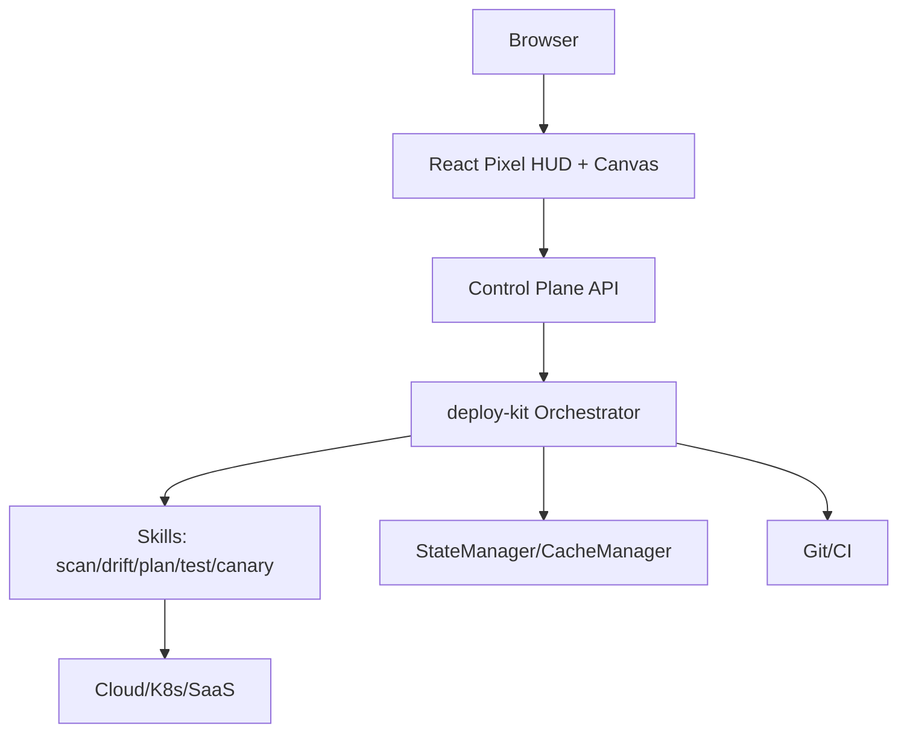

# IaC 城市建造系统（CityBuilder）- 设计文档

## 0. 摘要
CityBuilder 以“城市建造/基地经营”的隐喻，把 IaC 的全生命周期（现网→IaC→校验/计划→测试部署→生产试运行→复盘）做成可操作、可回放、可度量的城市施工体验。

本项目以 OAM（Open Application Model）为核心建模语言，并将其映射为“城市六件套”信息架构，解决 IaC 资源爆炸带来的理解与协作成本。

## 1. 目标与非目标

### 1.1 目标
- 把 IaC 的“工程语言”转译成可视化城市语言，让开发/DevOps/SRE 在同一画面内完成“规划-审批-施工-验收”。
- 面向真实用户流覆盖三类场景：
  - 现网有资源 → 生成 IaC 蓝图
  - 现网有资源 + 已有 IaC → 基于现网同步/更新 IaC（drift→patch）
  - 从 0 创建 → 生成 IaC 蓝图并走完整交付链路
- 对齐交付链路的闸门：语法校验 → 计划生成 → 测试部署 → 生产试运行 → 验证 → 完成/回撤。

### 1.2 非目标（短期不做）
- 不追求把所有云资源 1:1 变成建筑；资源级细节只在“建筑内部部件”视图中呈现。
- 不把 3D/体素作为首要方向；优先实现 2D 像素 HUD + Canvas 世界层，3D 仅作为后续可选增强。
- 不在原型期承诺多租户权限、计费、完整审计与真实云账号执行；先用 mock 数据把信息架构与心智模型跑通。

## 2. 核心隐喻：城市六件套（与 OAM 的映射）

### 2.1 OAM → City 映射

| OAM 概念 | City 隐喻 | 产品内呈现 |
|---|---|---|
| Application | 城市蓝图（Blueprint） | IaC repo / 应用规格的版本化蓝图 |
| Component | 建筑/设施（Building） | 城市里可放置、可点选的实体 |
| Trait | 配套/升级（Upgrade） | 建筑的扩容、HA、备份、灰度、限流等“附加件” |
| Policy | 城市法规（Law） | 施工许可、最小授权、数据金库条例、预算红线等闸门 |
| Workflow | 施工许可链路（Permit Flow） | 校验/计划/测试/试运行/验收时间轴 |
| Resource | 建筑内部部件（Parts） | 建筑详情抽屉中的资源清单与差异 |
| Configuration Drift | 违建/漂移（Drift） | 建筑状态贴纸 + Drift 分类解释 |

### 2.2 分层/缩放原则（解决资源爆炸）

| 层级 | 概念 | 默认可见性 | 交互粒度 |
|---|---|---|---|
| 宏观层 | 城市（City Instance） | 默认视图 | 城市 KPI、工程单分布 |
| 中观层 | 街区（District） | 点击进入 | 按职能聚合的建筑清单 |
| 微观层 | 建筑（Building） | 点击/抽屉 | 建筑状态、风险/预算、配套/法规 |
| 内部层 | 部件（Parts） | 抽屉深入 | 资源级清单、drift/diff、建议动作 |

### 2.3 街区划分（六大街区）

说明：街区用于聚合与导航，不等同于网络分区或云账号分区。

- **业务街区**：微服务/函数/作业（应用产能）
- **数据仓储区**：数据库/缓存/对象存储（资产与状态）
- **交通网络区**：VPC/LB/Ingress/CDN（城市动脉与分流）
- **安全治理区**：IAM/KMS/Secret/Policy（通行证与法典）
- **监控运维区**：日志/指标/告警/追踪（城市监控）
- **配置文书区**：Config/Parameter/Env Vars（文书系统与印章）

## 3. 真实用户流（场景与产物）

### 3.1 三类场景

| 场景 | 输入 | 目标输出 | 城市叙事 |
|---|---|---|---|
| 现网→生成 IaC | 账号/集群/资源范围 | IaC 工程（蓝图）+ Inventory | 城市普查建档：把“现网”变成“蓝图” |
| 现网+IaC→同步 IaC | 现网扫描 + IaC repo | Drift 报告 + IaC Patch | 违建稽查整改：输出最小整改方案 |
| 从 0→生成 IaC | 模板/参数/约束 | IaC 工程 + 交付流水 | 新区规划建设：从拿地到竣工 |

### 3.2 Drift 分类（用于解释与治理）

| Drift 类型 | 城市语言 | 典型动作 |
|---|---|---|
| none | 正常 | 不处理 |
| changed | 设施老化/配置变动 | 生成 patch 或纳入豁免 |
| extra | 违建/私拉电线 | 必须整改或封存 |
| missing | 图纸缺失/未落地 | 补齐 IaC 或回滚现网 |

### 3.3 施工许可链路（交付闸门）

该链路贯穿所有场景，决定是否允许进入主城施工。

1. 图纸审查（IaC 语法校验）
2. 施工评估（Plan 生成 + 风险/预算评估）
3. 沙盘施工（测试部署/沙箱环境）
4. 试通车（生产试运行/灰度）
5. 竣工验收（验证 + 复盘/回撤预案）

## 4. UX 结构（HUD 城市建造风格）

### 4.1 体验基线
目标风格参考 `demo-pixel.html`：Canvas 世界层 + 四周像素 HUD 浮层。

核心要求：
- 世界层可拖拽平移、滚轮缩放。
- HUD 组件稳定，信息永远“贴脸”。
- 点击建筑出现左侧信息面板（inspect），显示 drift/预算/风险与动作按钮。

### 4.2 主界面与导航

| 界面 | 目的 | 对应六件套 |
|---|---|---|
| 城市施工地图（Map HUD） | 放置/查看建筑、选择工程单、查看 KPI | 城市/建筑/工程单 |
| 规划局（蓝图工坊） | 普查、生成蓝图/整改、预览输出 | 街区/部件/配套/法规 |
| 审批大厅（评审关卡） | 评审差异、确认风险、发放施工许可 | 法规/工程单 |
| 施工指挥中心（战报） | 跟踪许可链路执行、日志回放、回撤 | 施工许可/复盘 |
| 街区视图（运营视角） | 按街区聚合建筑清单、快速巡检 | 街区/建筑 |

### 4.3 HUD 区块职责（建议）

- 顶部状态栏：建筑数、漂移数、预算（月维护费变化）、城市健康度（SLO/告警）。
- 右侧工具栏：建筑调色板（服务/金库/城门/车站/监控塔等）与“条例卡”切换。
- 左侧信息面板：选中建筑的状态、部件、风险/预算、推荐条例、动作（同步蓝图/申请许可/回撤）。
- 底部动作栏：普查、稽查、生成代码、进入施工（对应工坊/审批/战报跳转）。

## 5. 数据与产物模型（产品语言）

### 5.1 核心实体

- Workspace：一个城市蓝图的工作区（关联 repo、工具链、环境）。
- Inventory Snapshot：一次普查得到的现网资源清单与依赖关系。
- IaC Artifact：输出物（IaC 工程 or Patch）。
- ChangeSet（工程单）：一次要推进的施工项目（包含差异、风险、预算、审批状态）。
- Run（施工实例）：一次许可链路执行（含步骤、日志、结果、回撤）。

### 5.2 资源与建筑的关系

- 建筑 = 以能力聚合的“可治理单元”（Component）
- 部件 = 建筑内部的资源清单（Resource list），用于承载 IaC diff 与 drift

## 6. 系统架构（面向与 deploy-kit 集成）

### 6.1 总览

### 6.2 事件与回放
城市建造体验的关键是“可回放”。后端应提供：
- Run 创建与状态查询
- Run 步骤事件流（建议 WebSocket/SSE）
- 日志片段与结构化事件（用于战报时间轴）

## 7. 视觉与文案规范（像素 HUD）

### 7.1 像素 UI 规则
- 边框：4px 硬边（或 2px 视密度调整），统一偏移阴影。
- Hover：-1px~-2px 位移 + 阴影加深。
- 选中：pulse/闪烁，但避免影响可读性。

### 7.2 字体策略（中文友好）
注意：`Press Start 2P` 不覆盖中文，直接全站使用会出现字体混用。

建议策略：
- 数字/KPI/短标签：像素字体
- 正文/说明：中文可读字体（系统默认或可控的中文字体）
- 保证同一组件内不要混两种字体（KPI 与正文分区）

## 8. 原型实现状态（当前仓库）

当前原型已在 `frontend/pixel-prototype/` 提供：
- 城市六件套命名与街区视图
- 规划局（工坊）→ 审批大厅 → 施工指挥中心链路
- Mock 数据贯通（Inventory/drift/输出/战报）

后续 UI 将进一步向 `demo-pixel.html` 的 HUD 结构靠拢：把 `/map` 变成 Canvas 世界层 + HUD 四角布局，其他页面作为二级深入界面。

## 9. 风险与对策

- 资源类型繁杂：用“建筑(能力) + 部件(资源)”两层建模，避免 1:1 映射。
- 漂移解释困难：引入 drift 分类与推荐动作，优先用城市语言给出“为什么”。
- 可读性与像素美学冲突：字体分层、信息密度分区、关键数值突出。

## 10. 里程碑建议（不承诺日期）

1. HUD 城市地图（Canvas）替换现有 Map 页面，保留现有数据模型与抽屉。
2. 规划局/审批/战报接入真实后端事件流（deploy-kit run events）。
3. 法规与配套卡片化（Policy/Trait 具象化），让闸门“像游戏规则”一样可理解。

